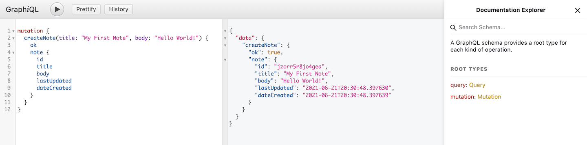

# Flask + GraphQL Demo

This is a Python demo application showcasing how GraphQL APIs can be developed and deployed with Flask.

The `tutorial-starter` directory contains the base Flask API without queries and mutations.

The `full-demo` directory contains the full application (Flask + GraphQL) with complete queries and mutations that implement CRUD functionalities in the demo.

